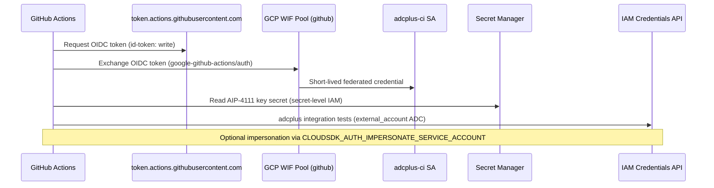

# Workload Identity Federation for GitHub Actions

This document describes how [adcplus](https://github.com/apstndb/adcplus) authenticates to GCP from GitHub Actions without storing service account JSON keys in the repository.
Most tests use WIF directly. The AIP-4111 self-signed JWT access token test uses a persistent, low-privilege service account key stored only in Secret Manager.

## Architecture



### Shared pool (apstndb-sandbox)

The `apstndb-sandbox` project already has a shared Workload Identity Pool:

| Resource | Value |
|----------|-------|
| Pool ID | `github` |
| Provider ID | `github` |
| OIDC issuer | `https://token.actions.githubusercontent.com` |
| Attribute mapping | `google.subject=assertion.sub`, `attribute.repository=assertion.repository`, `attribute.actor=assertion.actor` |
| Provider condition | `assertion.repository.startsWith('apstndb/') && assertion.ref == 'refs/heads/main'` |

Repository-specific access is enforced by binding `roles/iam.workloadIdentityUser` on a dedicated service account to:

```text
principalSet://iam.googleapis.com/projects/PROJECT_NUMBER/locations/global/workloadIdentityPools/github/attribute.repository/apstndb/adcplus
```

Only workflows running on **`main`** can obtain tokens today (provider-level branch restriction). To allow PRs or other branches, update the provider attribute condition in GCP (outside this repo's Terraform).

### adcplus-dedicated resources (this repo)

Terraform under [`infra/wif/`](../infra/wif/) manages:

- Service account `adcplus-ci@PROJECT.iam.gserviceaccount.com`
- `roles/iam.workloadIdentityUser` for `apstndb/adcplus` principals
- `roles/iam.serviceAccountTokenCreator` on itself (self-impersonation / Credentials API tests)
- `roles/iam.serviceAccountUser` at project level (call IAM Credentials API as the SA)
- Optional `serviceAccountTokenCreator` on a separate impersonation target SA

## One-time GCP setup

### Prerequisites

- GCP project with billing enabled (recommended: dedicated test project; default example uses `apstndb-sandbox`)
- IAM permissions to create service accounts and IAM bindings (`roles/iam.securityAdmin` or equivalent)
- `gcloud`, Terraform >= 1.5 (see `.tool-versions`; use `mise exec -- terraform`), and IAM admin on the target project

### Apply Terraform

```bash
# From repo root; uses active gcloud project unless you pass a project ID.
chmod +x scripts/setup-wif.sh
./scripts/setup-wif.sh apstndb-sandbox
```

Or manually:

```bash
cd infra/wif
cp terraform.tfvars.example terraform.tfvars   # edit project_id if needed
terraform init
terraform apply
terraform output github_actions_auth_snippet
```

If resources were created earlier with gcloud, import them before apply:

```bash
chmod +x scripts/import-wif-state.sh
./scripts/import-wif-state.sh apstndb-sandbox
```

### Equivalent gcloud commands

If you prefer not to use Terraform, these commands mirror what the module creates (replace `PROJECT_ID` and `PROJECT_NUMBER`):

```bash
PROJECT_ID=apstndb-sandbox
PROJECT_NUMBER=$(gcloud projects describe "$PROJECT_ID" --format='value(projectNumber)')
POOL="projects/${PROJECT_NUMBER}/locations/global/workloadIdentityPools/github"
MEMBER="principalSet://iam.googleapis.com/${POOL}/attribute.repository/apstndb/adcplus"

gcloud iam service-accounts create adcplus-ci \
  --project="$PROJECT_ID" \
  --display-name="adcplus GitHub Actions CI"

SA="adcplus-ci@${PROJECT_ID}.iam.gserviceaccount.com"

gcloud iam service-accounts add-iam-policy-binding "$SA" \
  --project="$PROJECT_ID" \
  --role="roles/iam.workloadIdentityUser" \
  --member="$MEMBER"

gcloud iam service-accounts add-iam-policy-binding "$SA" \
  --project="$PROJECT_ID" \
  --role="roles/iam.serviceAccountTokenCreator" \
  --member="serviceAccount:${SA}"

gcloud projects add-iam-policy-binding "$PROJECT_ID" \
  --member="serviceAccount:${SA}" \
  --role="roles/iam.serviceAccountUser" \
  --condition=None
```

To test impersonation of another service account (e.g. `self-signable@apstndb-sandbox.iam.gserviceaccount.com`):

```bash
TARGET="self-signable@${PROJECT_ID}.iam.gserviceaccount.com"
gcloud iam service-accounts add-iam-policy-binding "$TARGET" \
  --project="$PROJECT_ID" \
  --role="roles/iam.serviceAccountTokenCreator" \
  --member="serviceAccount:${SA}"
```

Set `impersonation_target_service_account` in `terraform.tfvars` to manage this binding via Terraform.

## GitHub configuration

WIF uses the repository's OIDC token for normal integration tests. The AIP-4111 test also reads a dedicated service account key from Secret Manager at workflow runtime; the key is not stored in GitHub secrets or in the repository.

### Repository variables (optional)

The workflow [`.github/workflows/integration-test.yml`](../.github/workflows/integration-test.yml) uses defaults for `apstndb-sandbox`. Override via **Settings → Secrets and variables → Actions → Variables**:

| Variable | Default | Description |
|----------|---------|-------------|
| `GCP_PROJECT_ID` | `apstndb-sandbox` | Target GCP project |
| `GCP_WORKLOAD_IDENTITY_PROVIDER` | `projects/463253289144/locations/global/workloadIdentityPools/github/providers/github` | Full provider resource name |
| `GCP_SERVICE_ACCOUNT` | `adcplus-ci@apstndb-sandbox.iam.gserviceaccount.com` | SA to impersonate via WIF |
| `ADCPLUS_AIP4111_PROJECT_ID` | `apstndb-sandbox` | Project whose Service Usage API is called by the AIP-4111 JWT test |
| `ADCPLUS_AIP4111_SECRET` | `adcplus-aip4111-service-account-key` | Secret Manager secret containing the dedicated AIP-4111 service account key |

After `terraform apply`, run `terraform output github_actions_auth_snippet` for exact values if the project number differs.

### Workflow permissions

The integration workflow requires:

```yaml
permissions:
  contents: read
  id-token: write   # required for OIDC → WIF
```

### Running integration tests

- **Manual:** Actions → Integration Test → Run workflow
- **Automatic:** pushes to `main` (after you are confident the setup is stable)

Local run (with user ADC or exported WIF credentials):

```bash
go test -tags=integration ./integration/...
```

For the AIP-4111 key-backed test, fetch the key into a restrictive temporary file and remove it after the run:

```bash
tmp="$(mktemp)"
chmod 600 "$tmp"
gcloud secrets versions access latest \
  --project=apstndb-sandbox \
  --secret=adcplus-aip4111-service-account-key > "$tmp"
ADCPLUS_AIP4111_SERVICE_ACCOUNT_KEY_FILE="$tmp" \
  ADCPLUS_AIP4111_PROJECT_ID=apstndb-sandbox \
  go test -tags=integration -count=1 -run TestSmartAccessTokenSource_AIP4111JWTAccessWithScope_serviceUsage ./integration/...
rm -f "$tmp"
```

### AIP-4111 service account key secret

The persistent key is intentionally limited to the AIP-4111 route test:

- Service account: `adcplus-aip4111-it@apstndb-sandbox.iam.gserviceaccount.com`
- Project role: `roles/serviceusage.serviceUsageViewer` on `apstndb-sandbox`
- Secret: `adcplus-aip4111-service-account-key`
- CI access: `roles/secretmanager.secretAccessor` on that secret only for `adcplus-ci@apstndb-sandbox.iam.gserviceaccount.com`

Do not manage the key material through Terraform, because service account key private material would end up in Terraform state. Create or rotate the key with `gcloud iam service-accounts keys create`, add the JSON as a Secret Manager version, then delete the local file.

## IAM roles reference for adcplus tests

| Scenario | IAM role | Where |
|----------|----------|-------|
| GitHub OIDC → SA | `roles/iam.workloadIdentityUser` | On `adcplus-ci` SA, member = WIF principalSet for `apstndb/adcplus` |
| WIF → external_account ADC | (automatic via auth action) | N/A |
| CI reads AIP-4111 key secret | `roles/secretmanager.secretAccessor` | Secret-level on `adcplus-aip4111-service-account-key` |
| AIP-4111 key calls Service Usage list | `roles/serviceusage.serviceUsageViewer` | Project-level on `adcplus-aip4111-it` |
| Self-impersonation (`CLOUDSDK_AUTH_IMPERSONATE_SERVICE_ACCOUNT=adcplus-ci@...`) | `roles/iam.serviceAccountTokenCreator` | On target SA (self) |
| Impersonate another SA | `roles/iam.serviceAccountTokenCreator` | On target SA, member = `adcplus-ci` |
| `SmartSigner` / `SmartAccessTokenSource` via Credentials API | `roles/iam.serviceAccountUser` | Project-level on `adcplus-ci` |
| Sign with local JSON key | N/A | Not used in CI (no keys in repo) |

Additional roles are only needed if integration tests call other GCP APIs (Storage, Spanner, etc.).

## Troubleshooting

| Symptom | Likely cause |
|---------|----------------|
| `Permission 'iam.serviceAccounts.getAccessToken' denied` | Missing `workloadIdentityUser` binding or wrong repository in principalSet |
| Works on main but not on PR branches | Provider condition restricts to `refs/heads/main` |
| `Unable to acquire impersonated credentials` | Missing `serviceAccountTokenCreator` on impersonation target |
| `The given credential is rejected by the attribute condition` | Repository not under `apstndb/` or branch not `main` |

## Org policy blockers

If apply fails, check:

- `iam.disableServiceAccountKeyCreation` — does not block WIF (keys not used)
- `iam.workloadIdentityPool` constraints — may require org admin to allow pool creation (pool already exists in sandbox)
- Cross-project WIF — use a provider in the same project as the service account
